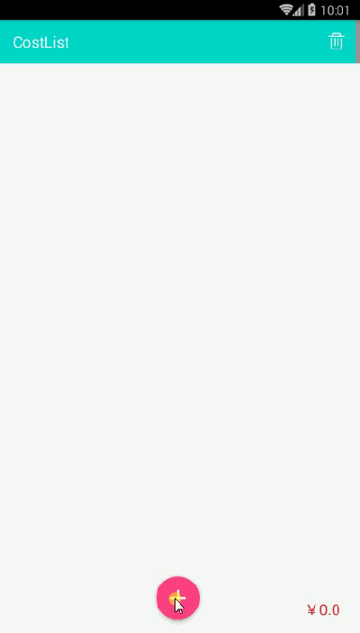
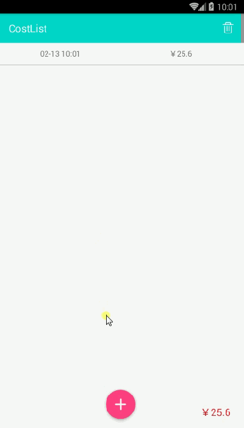
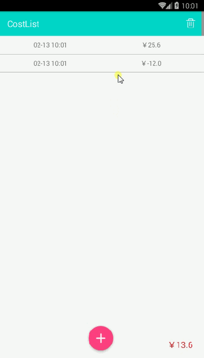

###CostList
-------
因为自己生活需要写的一款非常简单的记账App。只有一个界面，由于记录的属性简单，使用SharedPreferences保存List。自动计算总价。
上图：

这个项目主要是为了熟悉design包里面的新控件用来练手的，涉及到了

  *   FloatActionButton
  *   CoordinatorLayout+ToolBarLayout
  *   SnackBar
     
还有一点记录下来是 Gson String转List时，要用到TypeToken，否则会发生异常